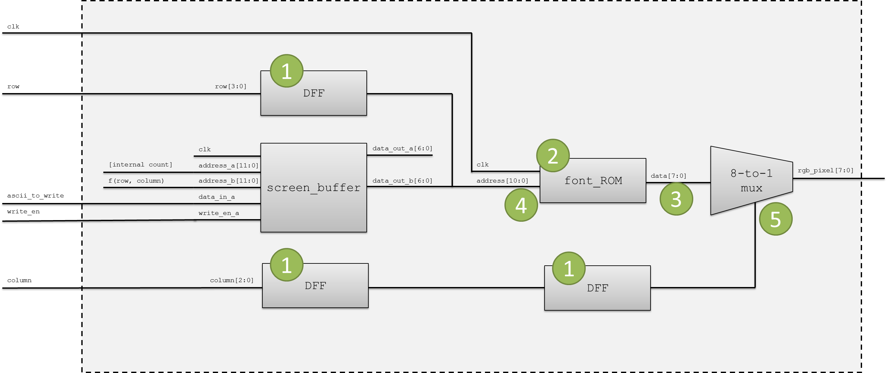
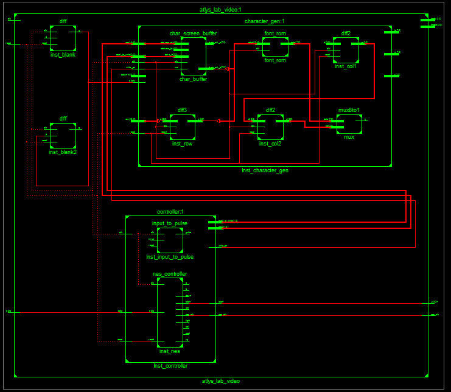
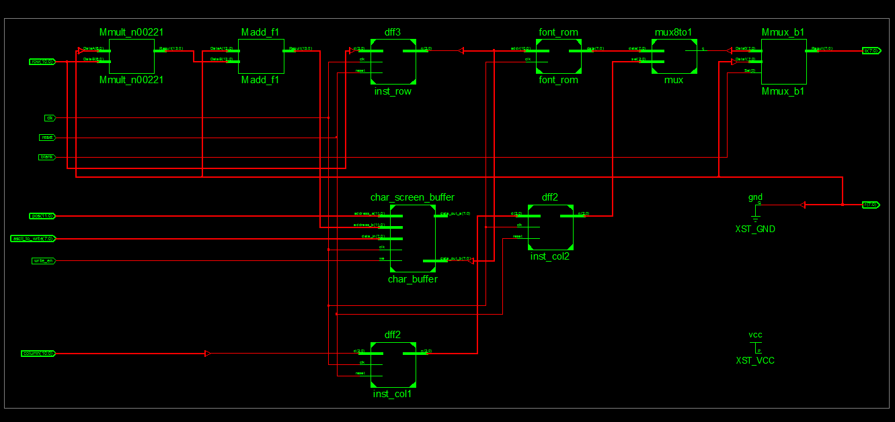

# Lab 3 #
## Table of Contents ##
- [Introduction](#introduction)
- [Approach](#approach)
- [Implementation](#implementation)
    - [Top Shell Diagram](#top-shell-diagram)
    - [Character Generator Diagram](#character-generator-diagram)
    - [State Machines/Registers](#character-generator)
    - [NES Controller](#nes-controller)
- [Testing and Debugging](#testing-and-debugging)
    - [Ball Speed Problem](#character-positioning)
    - [Ball Teleportation Problem](#math)
    - [Scrolling](#scrolling)
- [Conclusion](#conclusion)
- [Documentation](#documentation)


## Introduction ##
The purpose of this lab was to use the VGA driver previously implemented in order to implement a font controller to place any ascii character on the 30x80 screen.  To verify that the font functionality had been fully met, several grading criteria were used.  The controller needed to be able to:

 1. Display characters in each of the 30 by 80 positions  
 2. Ensure no character was partially off the screen  
 3. Use on board switched to select a character, B Functionality
 4. Interface with an NES Controller to select a character, A Functionality

## Approach ##
The most important part to the lab was the correct implementation of the character gen module show in the picture below.  The module needed to be created in the following steps.

 - Determine which row column we were in, f(row column) ex:


graphic 1
 - Pipeline the row and column signals
 - Determine address of font rom needed
 - Determine when the pixel should be displayed ex:


graphic 2

Overall Module
 

graphic 3
## Implementation ##
For the character generator module that needed to be implemented, there were two main sections.  A great amount of subcomponents were created in order to reduce the amount of code needed in the character generator module to increase readability.
### Top Shell Diagram ###

graphic 4
### Character Generator Diagram ###

graphic 5
### Character Generator ###
The mot important part of the character generator module was the current position of the module that is being read.  This is displayed in graphic 3 as the function(row, col) going into the screen buffer.  The numbering schema used in graphic 2 demonstrates the output of the function.  Therefore the function needed to be an output of the column in addition to the row multiplied by eighty.  The VHDL code written to do this was:
```vhdl
1  f<= unsigned( unsigned(column(10 downto 4)) + 80 * unsigned(row(10 downto 3)));
```
> **Alert!** This is the source of much frustration later on

None of the other code written for graphic three is noteworthy, however, implementing the B functionality was interesting.  In order to determine which ascii character was to be written on the screen, the eight input switches were concatenated and sent to the input ascii_to_write signal seen on graphic 2.   The [internal count] seen on the same graphic was implemented using a simple counting state machine that incremented whenever the input button was detected.  The input ascii character is represented by:
```vhdl
	ascii_to_write => eight & seven & six & five & four & three & two & one
```
### NES Controller ###
Implementing the NES controller proved to be an interesting problem.  All the code determining the internal count and current character value to be written was pulled out of the character generator module and moved into a new module controller.  The controller module provided the character generator with an address, ascii value, write enable, and position signal.  This allowed for most of the logic to be moved from the controller module and separated from the character generator entity.  Determining which button had been pressed on the NES controller look like:
```vhdl
1   ascii_more<= ascii_num+1;
2   ...
3	if(rising_edge(clk)) then
4		write_en_temp<= '0';
5		if(pulse='1') then
6				if(up='1') then
7			    	ascii_num<= ascii_more;
8					write_en_temp<= '1';
9				end if;
```
The code for the left, right, and down buttons is just the above code with a couple more if statements.  The modified input to pulse module allowed for the pulse to work very well with the buttons and preventing everything from scrolling too quickly.
## Testing and Debugging ###
Several issues arose during the implementation of the character_gen module and the top shell.
### Character Positioning ###
The first significant problem was maintaining that the characters were not bleeding on the left or right side of the screen.  Since the code in the character gen was being delayed by two, all the signals going to the dvid module except the clock needed to be slowed down by two clock signals as well.  The example of the blank signal being slowed down follows.
```vhdl
1	inst_blank: entity work.dff
2		port map(	 
3		    clk => pixel_clk,
4		    reset => reset,
5		    d => blank,
6		    q => blank_temp);
7	inst_blank2: entity work.dff
8		port map(
9		    clk => pixel_clk,
10		    reset => reset,	
11		    d => blank_temp,
12		    q => blank_temp2);
```
### Math ###
In order to determine which character was being displayed, a function was needed in order to determine which cell we were in.  When I first wrote the function incorrectly, the A's stilled showed correctly on the screen.  When working on B functionality, when characters are not all the same, two characters would be written on different portions of the screen.  The incorrect position function follows:
```vhdl
1  f<= unsigned( unsigned(column(10 downto 4)) + 80 * unsigned(row(10 downto 3)));
```
The correct position function code is:
```vhdl
1   f<= unsigned( unsigned(column(10 downto 3)) + 80 * unsigned(row(10 downto 4)));
```
This error took most of the time on the project to correct and was spotted by the instructor.
### Scrolling ###
The original implementation of the input to pulse did not allow for easy scrolling, since the button needed to be released for every position change.  To change this, the following code was modified slightly.
```vhdl
1	elsif(rising_edge(clk)) then
2		if(state_reg=idle and input='1') then
3			state_next<=high;
4		elsif(state_reg=high and counter=four_milli) then
5			if(input = '0') then
6				state_next<= idle;
7			else
8				state_next<= high;
9			end if;
10		end if;
```
The modified implementation did not rely on the button being released, but instead increased the delay between moving back to the idle state.  This allowed for a single pulse to be sent every 400ms, without the button being released and a nice scrolling motion to be accomplished
```vhdl
1	elsif(rising_edge(clk)) then
2		if(state_reg=idle and input='1') then
3			state_next<=high;
4		elsif(state_reg=high and counter=four_hundred_milli) then
5				state_next<= idle;
6		end if;
```
## Conclusion ##
The amount of time needed to implement full functionality for this lab was much less than the first.  This most likely can be attributed to significant decrease in the amount of process statements that were used to implement the design. Don't forget the UCF file!
## Documentation ##
None